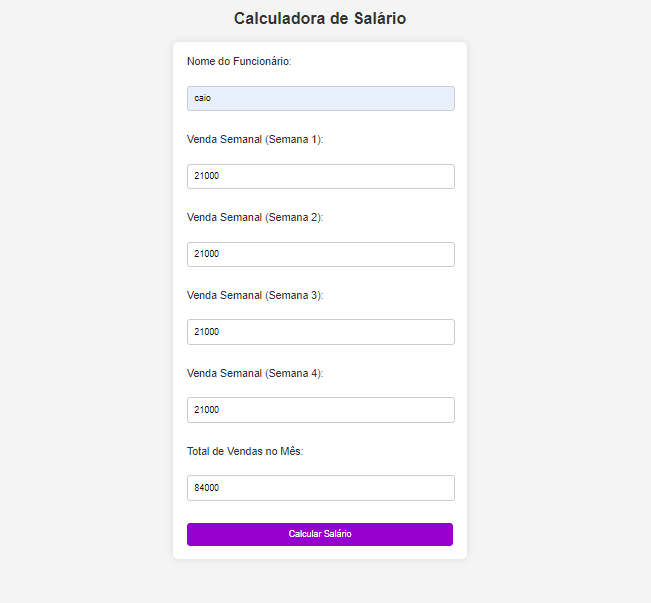
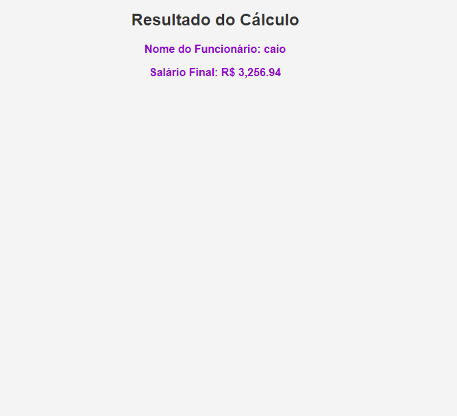

# Sistema para Calcular Sálario

## Atividade proposta
Instruções
A empresa na qual Fabinho e Renata trabalhavam (para entender, leia o documento em anexo), passou por uma reformulação no negócio. Eles contrataram uma consultoria do SEBRAE e durante alguns meses, houveram muitas mudanças significativas.  

Uma delas, foi a implantação de um sistema de meritocracia. Gradativamente a empresa foi reestruturando o plano de cargos e salários com alguns benefícios.  

Para os(as) vendedores(as), essa reformulação foi ainda mais impactante, uma vez que os salários desses profissionais era mais baixo e não atraia interessados. Na loja haviam 5 vendedores(as). Entre eles, 3 mulheres e 2 homens. Além de vender dentro da loja, eles também faziam vendas externas, o que rendia um dinheiro extra, através de uma comissão paga em separado do salário final. Todos(as) queriam vender externamente, mas era escolhido aquele(a) que tinha melhor desempenho nas vendas.  

O Sistema de cálculo dos salários dos(as) vendedores(as) foi utilizada como tarefa no processo seletivo para a pessoa que ocuparia o cargo de assistente administrativo. Lembra, aquela que Fabinho e Renata participaram? (Está no anexo)  

A empresa definiu o seguinte:

Todo(a) vendedor(a) tem salário mínimo definido[1], como pagamento base pelos serviços prestados.  
Todo(a) vendedor(a) tem meta de venda semanal. Essa meta é de 20 mil reais, totalizando 80 mil/mês por vendedor(a).
Todo(a) vendedor(a) que ultrapassar as metas semanais, receberão um percentual sobre o excedente da meta semanal.
Todo(a) vendedor(a) que exceder o volume da meta mensal, receberá uma bonificação, um percentual sobre o valor excedente da meta mensal. Isso NÃO valerá em caso do não cumprimento de ao menos uma das metas semanais.
 

Os valores definidos são:

Para o cumprimento de meta semanal: receberá  1% sobre o valor da meta.
Para o excedente de meta semanal: Receberá 5% sobre o excedente da meta semanal.
Para o excedente de meta mensal: Receberá 10% sobre o excedente de meta mensal.

Um exemplo:

Em caso de alcance/ultrapassagem das metas, num valor de 21000,00 de venda semanal, todas as semanas do mês, o(a) vendedor(a) receberia os seguintes bônus:

Meta semanal:                         200,00 x 4 semanas = 800,00
Excedente de meta semanal:            50,00 x 4 semanas = 200,00
Excedente de meta mensal:             400,00

 

O salário recebido por esse(a) colaborador(a) seria de:

- Salário final = Salário mínimo + valor sobre meta semanal + valor sobre o excedente de meta semanal + valor de excedente de meta mensal.

- Caso o(a) vendedor(a) não consiga bater ao menos uma meta semanal, ele perde o direito ao excedente de meta mensal, fazendo jus somente ao excedente de meta semanal, nas semanas em que conseguir esse feito.
-----

## Desenvolvido
 Nessa atividade criei uma calculadora para uma empresa, onde o RH pode calcular quanto o funcionário fez em todas as semanas e no mês, para o efetuar o pagamento com bonificação ou não.
Utilizando as linguagens: `HTML`, `CSS` e `PHP`. 

### Aqui está um print do sistema: 
   
   

 ### Fontes Utilizadas
 *  https://www.aen.pr.gov.br/Noticia/Maior-do-Brasil-governador-confirma-novo-Piso-Regional-que-vai-de-R-18-mil-R-21-mil#:~:text=Na%20primeira%2C%20que%20contempla%20os,de%20R%24%201.927%2C02

### Tecnologias Utilizadas
* BlackBox
* Visual Studio Code
